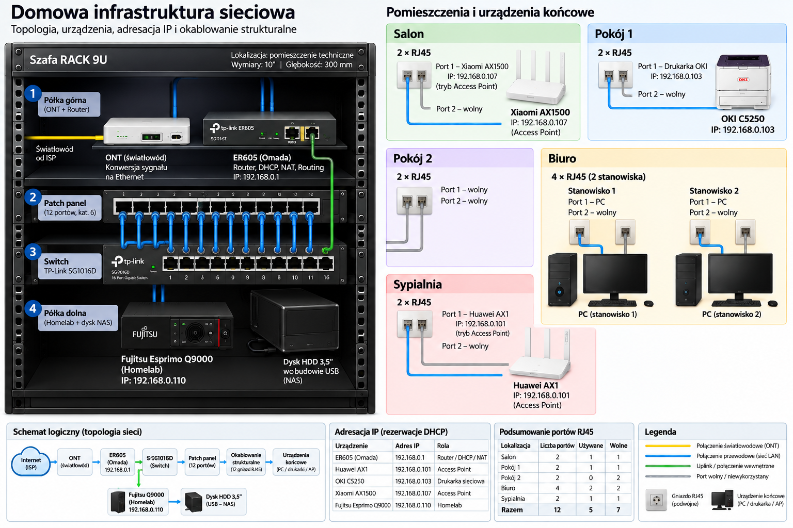

# Domowa sieć LAN

Praktyczny projekt domowej infrastruktury sieciowej obejmujący okablowanie strukturalne Ethernet, router, przełącznik, punkty dostępowe Wi-Fi oraz serwer Homelab.

Projekt został wykonany z myślą o zapewnieniu stabilnej komunikacji pomiędzy urządzeniami, możliwości dalszej rozbudowy sieci oraz stworzeniu infrastruktury dla serwera Homelab i usług działających w sieci lokalnej.

## Zakres projektu

Projekt obejmuje:

- zaprojektowanie i wykonanie okablowania strukturalnego Ethernet,
- konfigurację routera TP-Link ER605,
- konfigurację sieci LAN i DHCP,
- konfigurację punktów dostępowych Wi-Fi,
- organizację infrastruktury w szafie rack 9U,
- konfigurację adresacji IP i rezerwacji DHCP,
- uruchomienie serwera Homelab na Debianie 13,
- konfigurację podstawowych usług sieciowych i serwerowych,
- dokumentację infrastruktury oraz jej konfiguracji.

## Topologia



Pełny opis topologii fizycznej i logicznej znajduje się w [network.md](network.md).

```text
Internet
   │
  ONT
   │
   ▼
TP-Link ER605
Router / Gateway
   │
   ▼
TP-Link SG1016D
Switch
   │
   ├── Patch panel 24 porty
   │      ├── Salon
   │      ├── Pokój 1
   │      ├── Pokój 2
   │      ├── Biuro
   │      └── Sypialnia
   │
   └── Fujitsu Esprimo Q9000
       Homelab / Debian 13
           └── USB HDD / NAS
```

## Infrastruktura sieciowa

Centralnym urządzeniem sieciowym jest **TP-Link ER605**, który odpowiada za:

- połączenie z Internetem przez PPPoE,
- routing,
- NAT,
- DHCP,
- zarządzanie rezerwacjami adresów IP.

Sieć lokalna działa w jednej podsieci:

```text
192.168.0.0/24
```

Brama sieciowa:

```text
192.168.0.1
```

Punkty dostępowe Xiaomi AX1500 oraz Huawei AX1 pracują w trybie Access Point. Routing, NAT i DHCP są realizowane centralnie przez ER605.

## Okablowanie strukturalne

Sieć wykorzystuje **24-portowy patch panel**, z czego obecnie wykorzystywanych jest 12 portów.

Okablowanie prowadzi do gniazd RJ45 rozmieszczonych w poszczególnych pomieszczeniach. Zastosowanie patch panela i modułów Keystone pozwala na uporządkowane zakończenie instalacji oraz dalszą rozbudowę infrastruktury.

Obecnie:

- 12 portów patch panela jest wykorzystanych,
- 12 pozostaje jako rezerwa,
- 5 z 12 punktów RJ45 jest aktualnie wykorzystywanych,
- 7 pozostaje dostępnych do przyszłego wykorzystania.

## Homelab

Serwerem Homelab jest **Fujitsu Esprimo Q9000** pracujący pod kontrolą **Debian 13**.

Serwer jest podłączony bezpośrednio do switcha i posiada rezerwację DHCP:

```text
192.168.0.110
```

Na serwerze uruchomione są m.in.:

- **SSH** — zdalne zarządzanie,
- **Samba** — udostępnianie danych w sieci lokalnej,
- **Netdata** — monitoring zasobów i parametrów systemu,
- **Nginx** — lokalny dashboard Homelab.

Do serwera podłączony jest zewnętrzny dysk HDD 3,5" wykorzystywany jako magazyn danych NAS.

## Adresacja

Wybrane urządzenia posiadają rezerwacje DHCP zarządzane centralnie przez router:

| Urządzenie | Adres IP | Rola |
|---|---|---|
| TP-Link ER605 | `192.168.0.1` | Router / Gateway / DHCP / NAT |
| Huawei AX1 | `192.168.0.101` | Access Point |
| OKI C5250 | `192.168.0.103` | Drukarka sieciowa |
| Xiaomi AX1500 | `192.168.0.107` | Access Point |
| Fujitsu Esprimo Q9000 | `192.168.0.110` | Homelab / serwer |

Komputery korzystają ze standardowego dynamicznego przydzielania adresów DHCP.

## Dokumentacja

Szczegółowa dokumentacja projektu znajduje się w:

**[network.md](network.md)**

Zawiera m.in.:

- szczegółowy opis infrastruktury,
- topologię fizyczną,
- topologię logiczną,
- opis okablowania,
- konfigurację sieci LAN,
- adresację IP,
- informacje o Homelabie,
- diagram topologii.

## Cel rozwojowy

Projekt jest częścią praktycznej nauki administracji systemami, sieciami oraz infrastrukturą IT.

Infrastruktura jest rozwijana i dokumentowana w ramach Homelabu.
